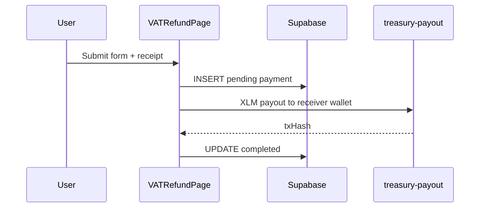
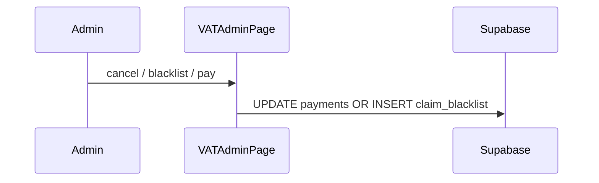

# Gemetra-XLM — Stellar Project Context

## What this app is

- **Product:** VAT refund infrastructure for tourists (**XLM only**)
- **Frontend:** React 18 + Vite + TypeScript + Tailwind
- **Identity:** Stellar wallet public key (`G...`), not Supabase Auth
- **Chain:** Stellar mainnet (`VITE_STELLAR_NETWORK=mainnet`, Horizon)
- **Wallets:** Freighter + Albedo via `@creit.tech/stellar-wallets-kit`
- **Backend:** Supabase PostgreSQL (`gtcmjxfqjtnshexujgmq`)
- **Payouts:** Treasury wallet via `treasury-payout` edge function (or dev plugin)
- **AI:** Google Gemini; EmailJS optional
- **Demo:** [https://youtu.be/ewvlCAq8bVM](https://youtu.be/ewvlCAq8bVM)
- **X:** [https://x.com/gemetraclaims](https://x.com/gemetraclaims)
- **Live:** [https://gemetra-xlm.vercel.app/](https://gemetra-xlm.vercel.app/)
- **Canonical URLs:** `src/config/links.ts`

## Key source files

| Area | Path |
|------|------|
| App shell / nav | `src/app/AppShell.tsx` |
| Official links | `src/config/links.ts` |
| Treasury config | `src/config/treasury.ts` |
| Treasury payouts | `src/services/treasuryPayout.ts` |
| Claim blacklist | `src/services/claimBlacklist.ts` |
| VAT math (53 countries) | `src/gemetra-ui/vatClaimMath.ts` |
| VAT form | `src/components/VATRefundPage.tsx` |
| Admin dashboard | `src/components/VATAdminPage.tsx` |
| Payments hook | `src/hooks/usePayments.ts` |
| Points | `src/hooks/usePoints.ts`, `src/utils/travelerPoints.ts` |
| Supabase client | `src/lib/supabase.ts` |
| Migrations | `supabase/migrations/` (5 files) |
| Soroban contract | `contracts/contracts/vat-refund/` |

## Core sequences

### VAT claim (tourist)



### Admin action



## Stellar conventions

- Settlement asset is **XLM** only
- Explorer: **Stellar Expert** (not Etherscan)
- Addresses: `G...` (56 chars)
- No MetaMask, WalletConnect, or Ethereum
- Dev on mainnet = real XLM; prefer testnet for experiments

## Supabase migrations (run in order)

1. `20260131000000_initial_schema.sql`
2. `20260223000000_stellar_only_cleanup.sql`
3. `20260223120000_drop_employees_payroll.sql`
4. `20260223130000_purge_non_xlm_vat_refunds.sql`
5. `20260223140000_admin_cancel_blacklist.sql`

Tables: `payments`, `claim_blacklist`, `user_points`, `point_transactions`, `point_conversions`, `chat_*`, `notifications`. **No `employees`.**

## Environment

```env
VITE_SUPABASE_URL=...
VITE_SUPABASE_ANON_KEY=...
VITE_STELLAR_NETWORK=mainnet
VITE_ADMIN_PUBLIC_KEY=G...
VITE_TREASURY_PUBLIC_KEY=G...
# Server only:
TREASURY_SECRET_KEY=S...
```

## AI / MCP stack

1. **Stellar Raven MCP** — live docs (`https://raven.stellar.buzz/mcp`)
2. **`.agents/skills/`** — official Stellar dev skills
3. **Project docs** — `docs/README.md`, `README.md`

## Soroban (optional)

`contracts/vat-refund` — on-chain claim registry. **Mainnet live:** `CBLVEZQ2RPBZQ6IPXW5TIL4DDM2IZ5QYDPTKTQ4CSDAINGT6MICKNQED`. **Testnet live:** `CAWEJXNXUZVF2RTKKEWONQ442E3KLB6B55NV33NJLPRBC56WYSZJAOBP` (see `contracts/deployments.json`). Frontend wiring is best-effort via `VITE_ENABLE_VAT_REFUND_ONCHAIN`.

```bash
pnpm run contract:build
pnpm run contract:test
pnpm run contract:deploy:testnet
```

## Workflow for new features

1. Read this skill + relevant `.agents/skills/*`
2. Match patterns in `treasuryPayout.ts`, `usePayments.ts`, `VAT*.tsx`
3. Test on testnet unless explicitly mainnet VAT
4. Add Supabase migration before new persisted fields
5. Update `docs/` if behavior changes

## Future directions

- Wire Soroban contract to claim flow
- SAC / USDC display currency
- Smart accounts for tourist UX
- x402 for paid AI endpoints
