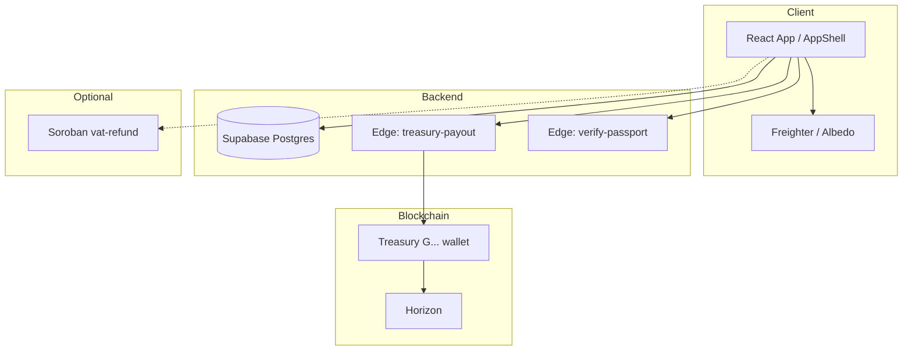
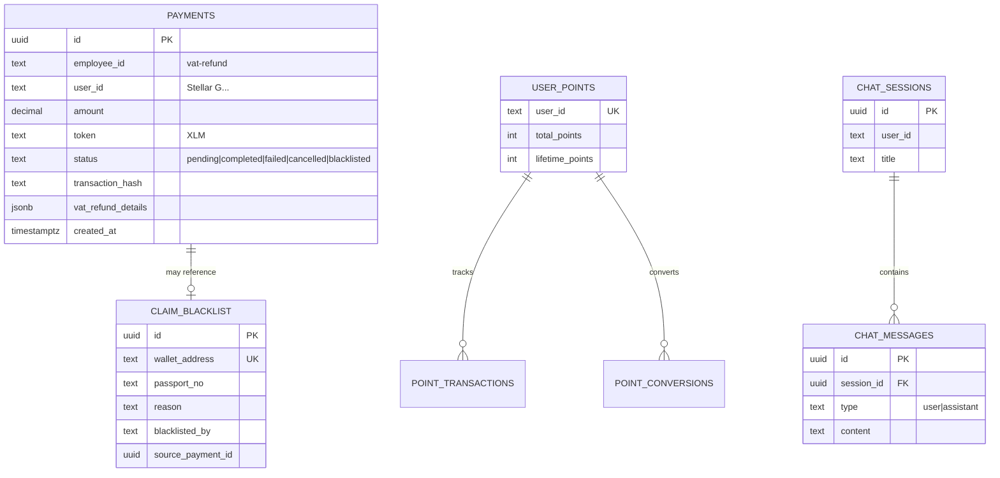
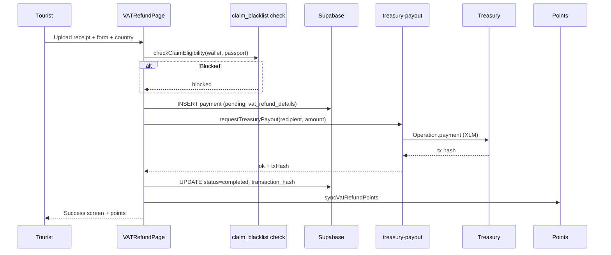
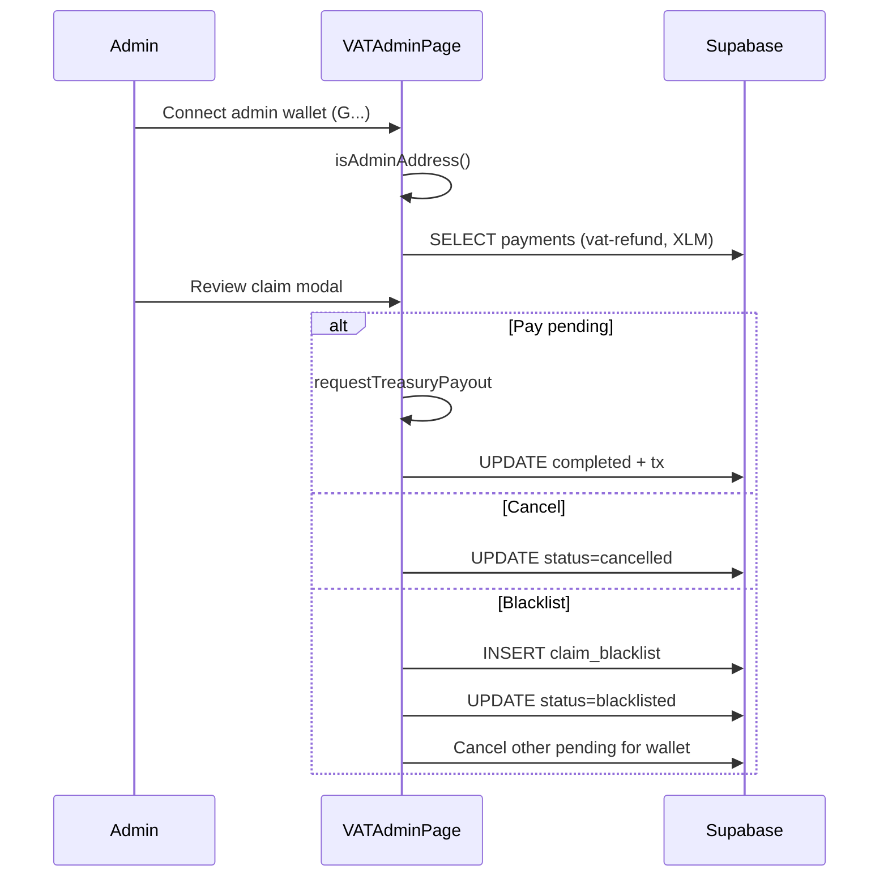
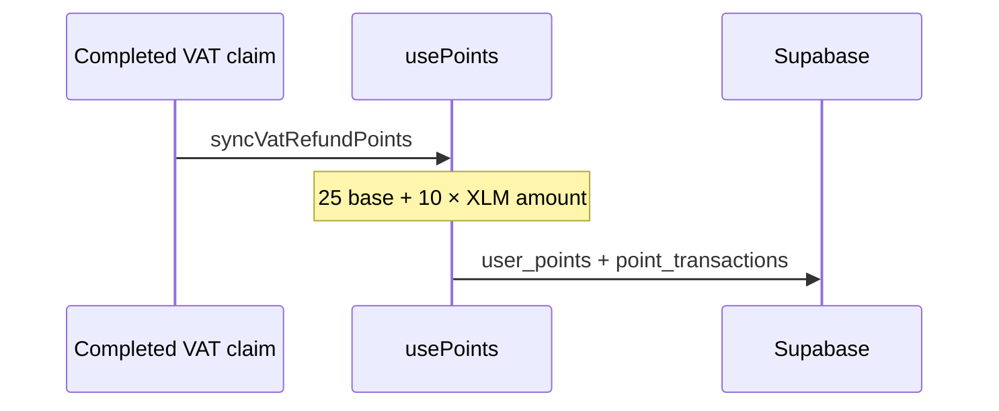
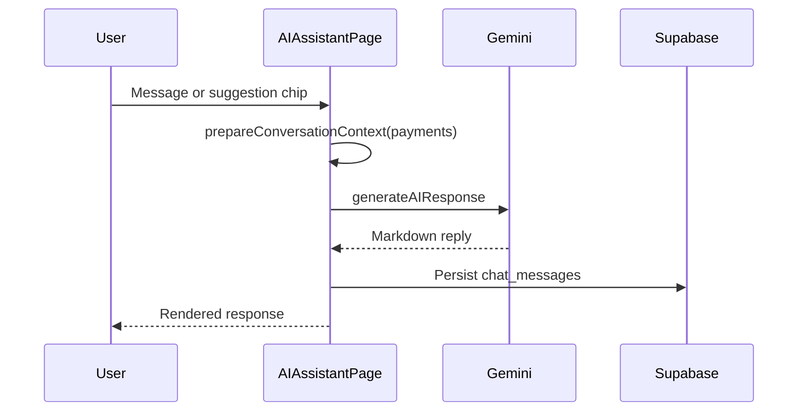

# Gemetra

**Instant VAT refund infrastructure on Stellar (XLM)** — wallet-native, borderless, built for tourists and tax authorities.

---

## Overview

Gemetra is a **Stellar/XLM tourist VAT refund dApp**:

- Tourists submit receipts and receive **XLM** payouts from a **treasury wallet**
- **Admin dashboard** reviews, pays, cancels, or blacklists claims
- **Gemetra Points** reward completed claims
- **AI assistant** (Gemini) answers VAT / Stellar questions
- Optional **Soroban contract** for on-chain claim registry (`contracts/`)

**Identity:** Stellar wallet public key (`G...`) — not Supabase Auth.

| Layer | Stack |
|-------|--------|
| Frontend | React 18, Vite, TypeScript, Tailwind |
| Wallets | Freighter, Albedo (`@creit.tech/stellar-wallets-kit`) |
| Backend | Supabase PostgreSQL |
| Payouts | Native XLM via `treasury-payout` edge function |
| AI | Google Gemini |
| Chain | Stellar mainnet (Horizon) |

📖 **Documentation:** [docs/README.md](./docs/README.md)

---

## System architecture



---

## Database schema (current)



> `employees` and payroll tables were **removed** — app is VAT-only.

---

## VAT refund flow



---

## Admin operations flow



---

## Points flow



Conversion: **100 points = 1 XLM** (ledger; auto treasury transfer planned). See [docs/POINTS_SYSTEM.md](./docs/POINTS_SYSTEM.md).

---

## AI assistant flow



---

## Project structure

```
src/
  app/AppShell.tsx          # Nav + routing
  components/               # VAT*, Dashboard, AI, Settings
  config/treasury.ts        # Admin + treasury public keys
  services/                 # treasuryPayout, aiService, claimBlacklist
  hooks/                    # usePayments, usePoints, useChat
  gemetra-ui/               # Design system + VAT country math
supabase/
  migrations/               # 5 SQL migrations (run in order)
  functions/treasury-payout/
contracts/
  contracts/vat-refund/     # Soroban registry (optional)
docs/                       # Setup, troubleshooting, flows
```

---

## Quick start

```bash
cp .env.example .env   # Supabase + Stellar keys
pnpm install
pnpm dev               # http://localhost:5173
```

1. Apply Supabase migrations — [docs/QUICK_SETUP.md](./docs/QUICK_SETUP.md)
2. Connect Freighter or Albedo
3. Submit a test VAT claim on **Submit Refund**
4. Open **Admin** with treasury/admin wallet

---

## Environment variables

| Variable | Required | Description |
|----------|----------|-------------|
| `VITE_SUPABASE_URL` | ✅ | Supabase project URL |
| `VITE_SUPABASE_ANON_KEY` | ✅ | Anon public key |
| `VITE_STELLAR_NETWORK` | ✅ | `mainnet` or `testnet` |
| `VITE_ADMIN_PUBLIC_KEY` | ✅ | Admin dashboard wallet |
| `VITE_TREASURY_PUBLIC_KEY` | ✅ | Payout source wallet |
| `TREASURY_SECRET_KEY` | Dev/prod server | Signs payouts (never in client) |
| `VITE_GEMINI_API_KEY` | Optional | AI assistant |

Full list: [docs/ENVIRONMENT_SETUP.md](./docs/ENVIRONMENT_SETUP.md)

---

## Supabase migrations

Run in order:

1. `20260131000000_initial_schema.sql`
2. `20260223000000_stellar_only_cleanup.sql`
3. `20260223120000_drop_employees_payroll.sql`
4. `20260223130000_purge_non_xlm_vat_refunds.sql`
5. `20260223140000_admin_cancel_blacklist.sql`

```bash
supabase db push --project-ref gtcmjxfqjtnshexujgmq
```

---

## Scripts

| Command | Description |
|---------|-------------|
| `pnpm dev` | Vite dev server |
| `pnpm build` | Production build |
| `pnpm test` | Vitest unit tests |
| `pnpm run deploy:treasury` | Deploy edge function |
| `pnpm run contract:build` | Build Soroban WASM |
| `pnpm run contract:test` | Rust contract tests |

---

## Features

- **53-country VAT math** — per-country rates and rules (`vatClaimMath.ts`)
- **Passport MRZ scan** — Tesseract + optional verification edge fn
- **Treasury payouts** — server-signed XLM (edge fn or local dev plugin)
- **Admin dashboard** — filter, export CSV, pay / cancel / blacklist
- **Claim blacklist** — wallet + passport blocking
- **Gemetra Points** — earn on claims, convert to XLM bonus
- **Soroban contract** — optional on-chain claim registry

---

## Smart contracts

Production payouts use **classic Stellar payments**, not Soroban. An optional **`vat-refund`** Soroban contract lives in `contracts/` for future on-chain claim anchoring.

See [contracts/README.md](./contracts/README.md).

---

## License

MIT
