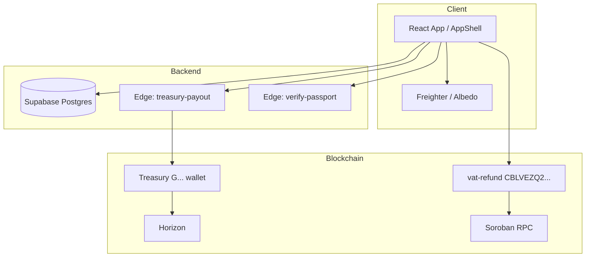
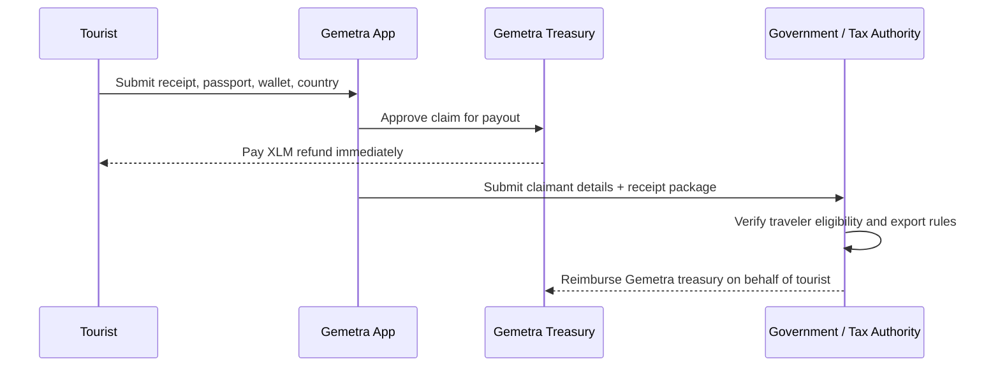
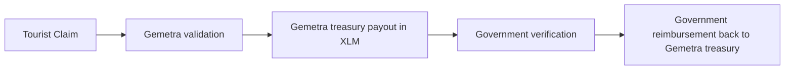
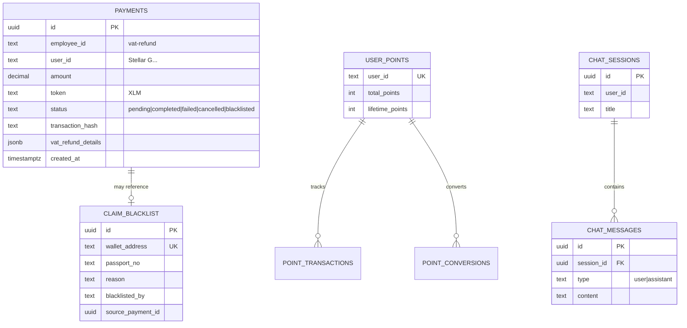
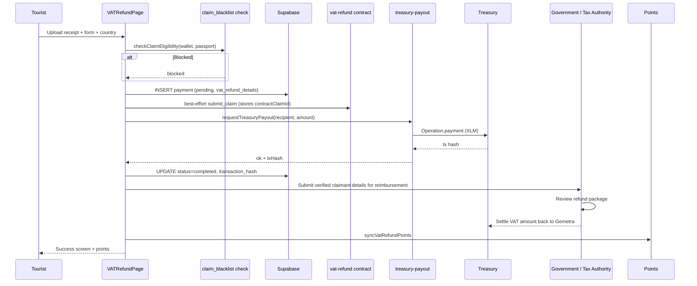
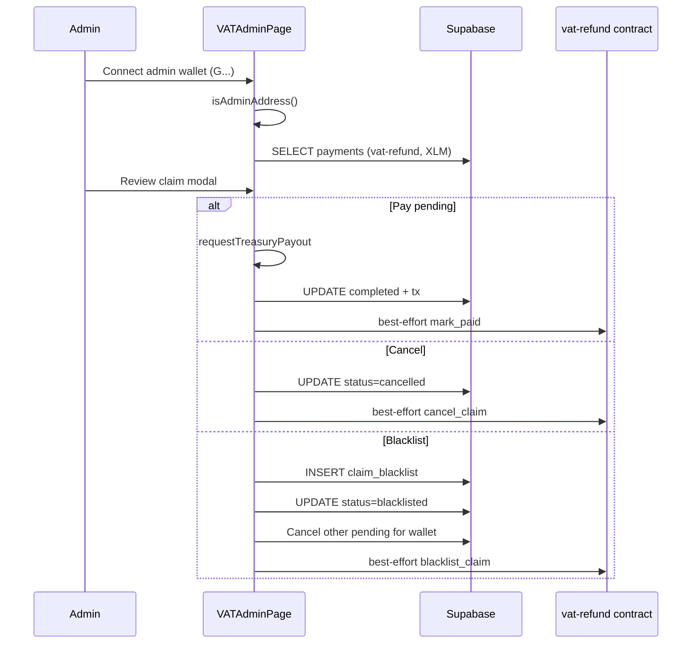
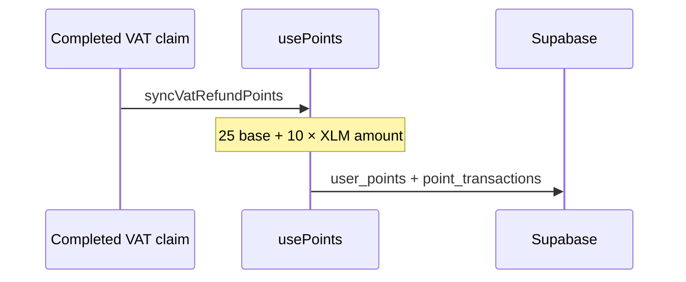
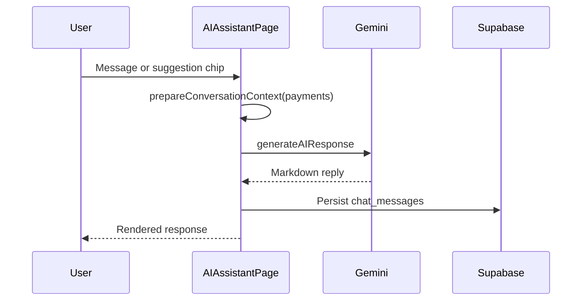

# Gemetra
   
**Instant VAT refund infrastructure on Stellar (XLM)** — wallet-native, borderless, built for tourists and tax authorities.

---

## Overview

Gemetra is a **Stellar/XLM tourist VAT refund dApp**:

- Tourists submit receipts and receive **XLM** payouts from a **treasury wallet**
- **Admin dashboard** reviews, pays, cancels, or blacklists claims
- **Gemetra Points** reward completed claims
- **AI assistant** (Gemini) answers VAT / Stellar questions
- Live **Soroban `vat-refund` registry** on Stellar mainnet (and testnet) — auditable claim ledger alongside off-chain payouts

**Identity:** Stellar wallet public key (`G...`) — not Supabase Auth.

| Layer | Stack |
|-------|--------|
| Frontend | React 18, Vite, TypeScript, Tailwind |
| Wallets | Freighter, Albedo (`@creit.tech/stellar-wallets-kit`) |
| Backend | Supabase PostgreSQL |
| Payouts | Native XLM via `treasury-payout` edge function |
| AI | Google Gemini |
| Chain | Stellar mainnet (Horizon + Soroban RPC) |
| Contract | `vat-refund` v2 — [CBLVEZQ2…NQED](https://stellar.expert/explorer/public/contract/CBLVEZQ2RPBZQ6IPXW5TIL4DDM2IZ5QYDPTKTQ4CSDAINGT6MICKNQED) |

📖 **Documentation:** [docs/README.md](./docs/README.md)

## Official Links

- **X:** [@GemetraClaims](https://x.com/gemetraclaims)
- **Pitch deck:** [Google Slides](https://docs.google.com/presentation/d/1SOSCBTUPK5O3G4oFRJQUXBdJWTl25d3eip3talr7e2s/edit?usp=sharing)
- **GitHub:** [AmaanSayyad/Gemetra-XLM](https://github.com/AmaanSayyad/Gemetra-XLM)
- **Live website:** [gemetra-xlm.vercel.app](https://gemetra-xlm.vercel.app/)
- **Mainnet contract:** [CBLVEZQ2…NQED](https://stellar.expert/explorer/public/contract/CBLVEZQ2RPBZQ6IPXW5TIL4DDM2IZ5QYDPTKTQ4CSDAINGT6MICKNQED)

---

## System architecture



---

## Treasury Settlement Model

Gemetra operates as a **fronting treasury** for tourist VAT claims:

1. The **tourist submits** a claim in the app.
2. **Gemetra treasury pays the tourist first** in XLM once the claim is accepted for payout.
3. Gemetra then **submits the verified claim package to the government / tax authority**.
4. The **government reimburses Gemetra treasury** on behalf of the tourist after review.

This means the tourist-facing payout rail and the government reimbursement rail are **separate legs** of the same claim lifecycle.





---

## Database schema (current)



> `employees` and payroll tables were **removed** — app is VAT-only.

---

## VAT refund flow



---

## Admin operations flow



---

## Points flow



Conversion: **100 points = 1 XLM** (ledger; auto treasury transfer planned). See [docs/POINTS_SYSTEM.md](./docs/POINTS_SYSTEM.md).

---

## AI assistant flow



---

## Project structure

```
src/
  app/AppShell.tsx          # Nav + routing
  components/               # VAT*, Dashboard, AI, Settings
  config/treasury.ts        # Admin + treasury public keys
  services/                 # treasuryPayout, vatRefundOnchain, claimBlacklist
  hooks/                    # usePayments, usePoints, useChat
  gemetra-ui/               # Design system + VAT country math
supabase/
  migrations/               # 5 SQL migrations (run in order)
  functions/treasury-payout/
contracts/
  contracts/vat-refund/     # Soroban registry (live on mainnet + testnet)
  deployments.json          # Contract IDs, wasm hash, explorer links
docs/                       # Setup, troubleshooting, flows
```

---

## Quick start

```bash
cp .env.example .env   # Supabase + Stellar keys
pnpm install
pnpm dev               # http://localhost:5173
```

1. Apply Supabase migrations — [docs/QUICK_SETUP.md](./docs/QUICK_SETUP.md)
2. Connect Freighter or Albedo
3. Submit a test VAT claim on **Submit Refund**
4. Open **Admin** with treasury/admin wallet

---

## Environment variables

| Variable | Required | Description |
|----------|----------|-------------|
| `VITE_SUPABASE_URL` | ✅ | Supabase project URL |
| `VITE_SUPABASE_ANON_KEY` | ✅ | Anon public key |
| `VITE_STELLAR_NETWORK` | ✅ | `mainnet` or `testnet` |
| `VITE_ADMIN_PUBLIC_KEY` | ✅ | Admin dashboard wallet |
| `VITE_TREASURY_PUBLIC_KEY` | ✅ | Payout source wallet |
| `TREASURY_SECRET_KEY` | Dev/prod server | Signs payouts (never in client) |
| `VITE_ENABLE_VAT_REFUND_ONCHAIN` | Optional | `true` to write claims to Soroban (best-effort) |
| `VITE_VAT_REFUND_CONTRACT_ID` | Optional | `C…` contract id (must match `VITE_STELLAR_NETWORK`) |
| `VITE_SOROBAN_RPC_URL` | Optional | e.g. `https://mainnet.sorobanrpc.com` |
| `VITE_GEMINI_API_KEY` | Optional | AI assistant |

Full list: [docs/ENVIRONMENT_SETUP.md](./docs/ENVIRONMENT_SETUP.md)

---

## Supabase migrations

Run in order:

1. `20260131000000_initial_schema.sql`
2. `20260223000000_stellar_only_cleanup.sql`
3. `20260223120000_drop_employees_payroll.sql`
4. `20260223130000_purge_non_xlm_vat_refunds.sql`
5. `20260223140000_admin_cancel_blacklist.sql`

```bash
supabase db push --project-ref gtcmjxfqjtnshexujgmq
```

---

## Scripts

| Command | Description |
|---------|-------------|
| `pnpm dev` | Vite dev server |
| `pnpm build` | Production build |
| `pnpm test` | Vitest unit tests |
| `pnpm run deploy:treasury` | Deploy edge function |
| `pnpm run contract:build` | Build Soroban WASM |
| `pnpm run contract:test` | Rust contract tests |
| `pnpm run contract:deploy:testnet` | Deploy `vat-refund` to Stellar testnet |
| `pnpm run contract:deploy:mainnet` | Deploy `vat-refund` to Stellar mainnet |

---

## Features

- **53-country VAT math** — per-country rates and rules (`vatClaimMath.ts`)
- **Passport MRZ scan** — Tesseract + optional verification edge fn; [passport & traveler trust scores](./docs/TRUST_SCORE.md)
- **Treasury payouts** — server-signed XLM (edge fn or local dev plugin)
- **Admin dashboard** — filter, export CSV, pay / cancel / blacklist
- **Claim blacklist** — wallet + passport blocking
- **Gemetra Points** — earn on claims, convert to XLM bonus
- **Soroban `vat-refund`** — live on-chain claim registry (mainnet + testnet)

---

## Smart contracts

XLM payouts still go through **classic Stellar payments** (`treasury-payout`). The **`vat-refund`** Soroban contract is the on-chain claim ledger: submit, approve, pay, government review, cancel, blacklist. It does **not** move XLM.

| Network | Contract ID | Explorer |
|---------|-------------|----------|
| **Mainnet** | `CBLVEZQ2RPBZQ6IPXW5TIL4DDM2IZ5QYDPTKTQ4CSDAINGT6MICKNQED` | [stellar.expert](https://stellar.expert/explorer/public/contract/CBLVEZQ2RPBZQ6IPXW5TIL4DDM2IZ5QYDPTKTQ4CSDAINGT6MICKNQED) · [Lab](https://lab.stellar.org/r/mainnet/contract/CBLVEZQ2RPBZQ6IPXW5TIL4DDM2IZ5QYDPTKTQ4CSDAINGT6MICKNQED) |
| **Testnet** | `CAWEJXNXUZVF2RTKKEWONQ442E3KLB6B55NV33NJLPRBC56WYSZJAOBP` | [stellar.expert](https://stellar.expert/explorer/testnet/contract/CAWEJXNXUZVF2RTKKEWONQ442E3KLB6B55NV33NJLPRBC56WYSZJAOBP) · [Lab](https://lab.stellar.org/r/testnet/contract/CAWEJXNXUZVF2RTKKEWONQ442E3KLB6B55NV33NJLPRBC56WYSZJAOBP) |

| | |
|---|---|
| **Version** | `2` (`version()` on-chain) |
| **Wasm hash** | `1940845fdaacc6293ce1250b54b6b4e1f8c039af9c5f71e92e0960961c6b4264` |
| **Admin / treasury / government** | `GDHAGXZUWGJR6AQW25IU74J5JSU5HAKUMUY3SY4JNMJXNXEJCZM7WOAW` |
| **Mainnet upload** | [06341e05…](https://stellar.expert/explorer/public/tx/06341e05eae52b822674b5c190f43bb1a187d0ae3c2c34397e11ceee958874db) |
| **Mainnet instantiate** | [c695b4a1…](https://stellar.expert/explorer/public/tx/c695b4a18a85f174cc80cae289f2902a4725984a134464c3c54b3ce005b3d6fd) |

Enable in the dApp (best-effort — a failed invoke does not block the off-chain claim or payout):

```env
VITE_ENABLE_VAT_REFUND_ONCHAIN=true
VITE_VAT_REFUND_CONTRACT_ID=CBLVEZQ2RPBZQ6IPXW5TIL4DDM2IZ5QYDPTKTQ4CSDAINGT6MICKNQED
VITE_SOROBAN_RPC_URL=https://mainnet.sorobanrpc.com
```

Use the testnet `C…` id and `https://soroban-testnet.stellar.org` when `VITE_STELLAR_NETWORK=testnet`.

```bash
pnpm run contract:build
pnpm run contract:test
pnpm run contract:deploy:testnet
pnpm run contract:deploy:mainnet
```

Source, state machine, and invoke docs: [contracts/README.md](./contracts/README.md). IDs and tx hashes: [contracts/deployments.json](./contracts/deployments.json).

---

## License

MIT
