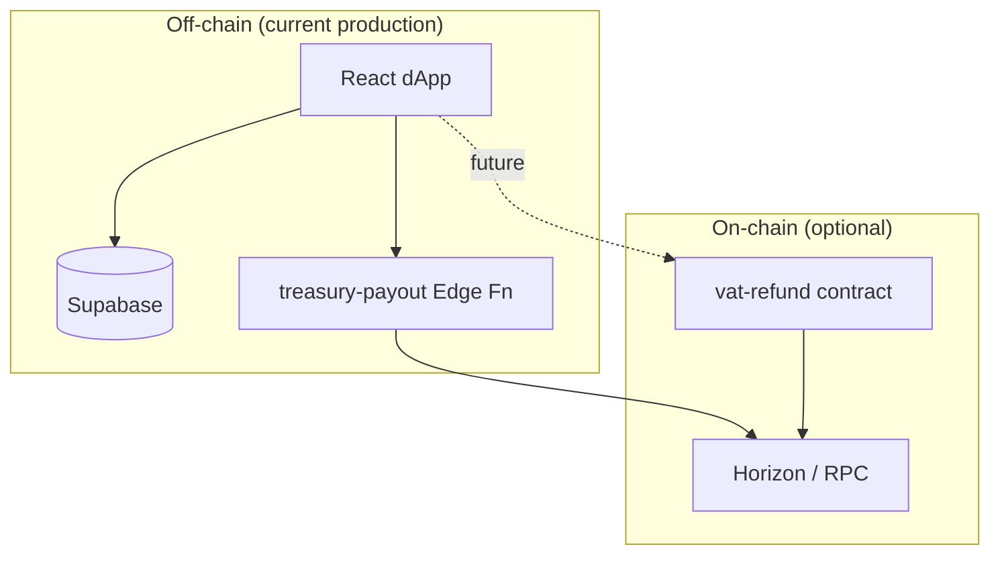
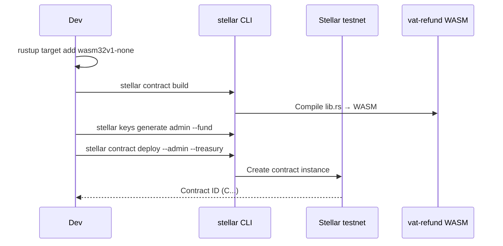
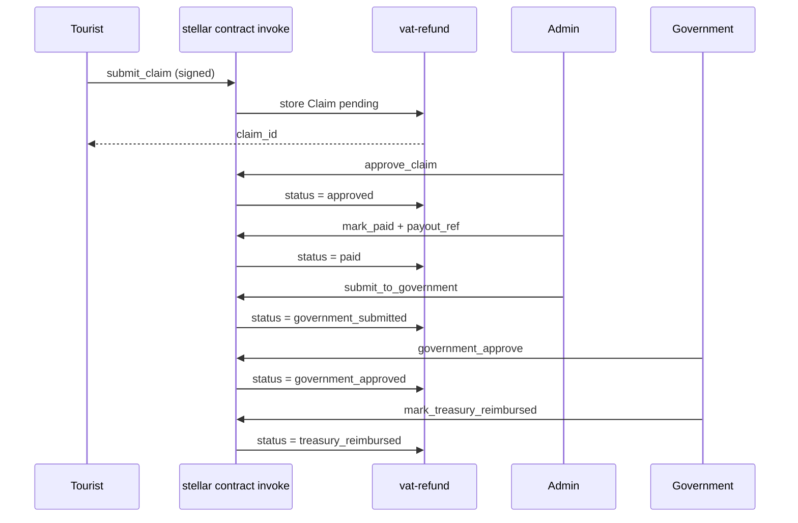

# Gemetra Soroban Contracts

On-chain smart contracts for Gemetra. **Standalone today** — the live dApp uses Supabase + classic Stellar XLM payments.

## Architecture



## Contract: `vat-refund`

**Path:** `contracts/vat-refund/`

| Function | Signer | Description |
|----------|--------|-------------|
| `submit_claim` | Claimant | Register pending claim (stroops, receipt hash, country) |
| `approve_claim` | Admin | Approve for payout |
| `mark_paid` | Admin | Record payout reference hash |
| `submit_to_government` | Admin | Submit verified package to government (after tourist payout) |
| `government_approve` | Government | Approve claim and authorize reimbursement |
| `government_reject` | Government | Reject claim after verification |
| `mark_treasury_reimbursed` | Government | Record reimbursement reference hash |
| `cancel_claim` | Admin | Cancel pending/approved |
| `blacklist_claim` | Admin | Blacklist + block wallet |
| `get_claim` | Anyone | Read claim |
| `is_wallet_blacklisted` | Anyone | Check blacklist |

## Claim state machine (tourist leg + government reimbursement leg)

This contract tracks the full lifecycle in a single on-chain state machine:

```mermaid
flowchart LR
    Pending[Pending (claim submitted)] --> Approved[Approved (admin approved for payout)]
    Approved --> Paid[Paid (tourist refund paid in XLM)]
    Paid --> GovernmentSubmitted[GovernmentSubmitted (package submitted)]
    GovernmentSubmitted --> GovernmentApproved[GovernmentApproved]
    GovernmentSubmitted --> GovernmentRejected[GovernmentRejected]
    GovernmentApproved --> TreasuryReimbursed[TreasuryReimbursed]
    Pending --> Cancelled[Cancelled]
    Approved --> Cancelled
    Pending --> Blacklisted[Blacklisted]
    Approved --> Blacklisted
```

All government interactions are recorded via **hash references** (receipt/claim package + decisions), so sensitive documents can remain off-chain.

## Deploy sequence



## Invoke sequence (after deploy)



## Prerequisites

- Rust ≥ 1.84, `wasm32v1-none` target
- [Stellar CLI](https://developers.stellar.org/docs/tools/cli) v27+

## Build & test

```bash
cd contracts
stellar contract build
cargo test -p vat-refund
# or from repo root:
pnpm run contract:build
pnpm run contract:test
```

Wasm: `target/wasm32v1-none/release/vat_refund.wasm`

## Deploy example (testnet)

```bash
stellar keys generate admin --network testnet --fund

stellar contract deploy \
  --wasm target/wasm32v1-none/release/vat_refund.wasm \
  --source-account admin \
  --network testnet \
  -- \
  --admin admin \
  --treasury GD...YOUR_TREASURY_G_ADDRESS \
  --government GD...YOUR_GOVERNMENT_G_ADDRESS
```

## Future app integration

1. Set `VITE_VAT_REFUND_CONTRACT_ID=C...` in `.env`
2. After Supabase insert → call `submit_claim` from user wallet
3. Admin panel → `approve_claim` / `mark_paid` / `submit_to_government` / `blacklist_claim`
4. Government operator tooling → `government_approve` / `government_reject` / `mark_treasury_reimbursed`

See [docs/FEATURE_IDEAS.md](../docs/FEATURE_IDEAS.md).
