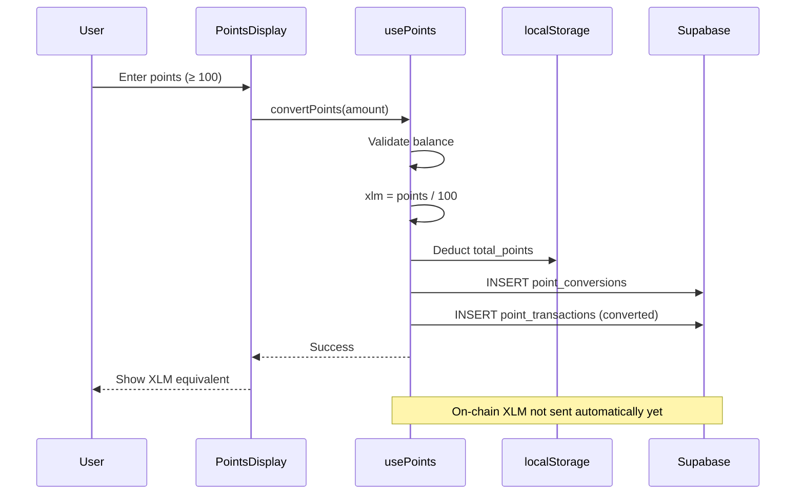
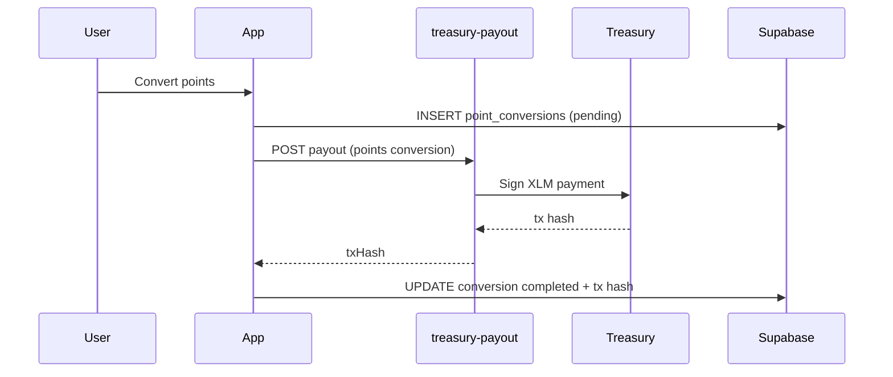

# Points → XLM Conversion Flow

What happens when a user clicks **Convert to XLM** in the points modal.

---

## Current flow (MVP)

### Steps

1. **Validate** — wallet connected, ≥ 100 points, sufficient balance
2. **Calculate** — `xlm_amount = points / 100`
3. **Deduct** — update `user_points.total_points`
4. **Record** — `point_conversions` + negative `point_transactions`
5. **UI** — badge updates immediately

---

## Production target

Options:

| Approach | Description |
|----------|-------------|
| **Edge function** | Reuse `treasury-payout` with `payoutType: 'points'` |
| **Admin batch** | Dashboard approves pending conversions daily |
| **Soroban** | On-chain redeem function (see `contracts/`) |

---

## Status

| Feature | Status |
|---------|--------|
| Points deduction | ✅ |
| Conversion records | ✅ |
| UI / history | ✅ |
| Automatic XLM transfer | ⚠️ Needs treasury wiring |

---

## Related

- [POINTS_SYSTEM.md](./POINTS_SYSTEM.md)
- [ENVIRONMENT_SETUP.md](./ENVIRONMENT_SETUP.md) — treasury secrets
