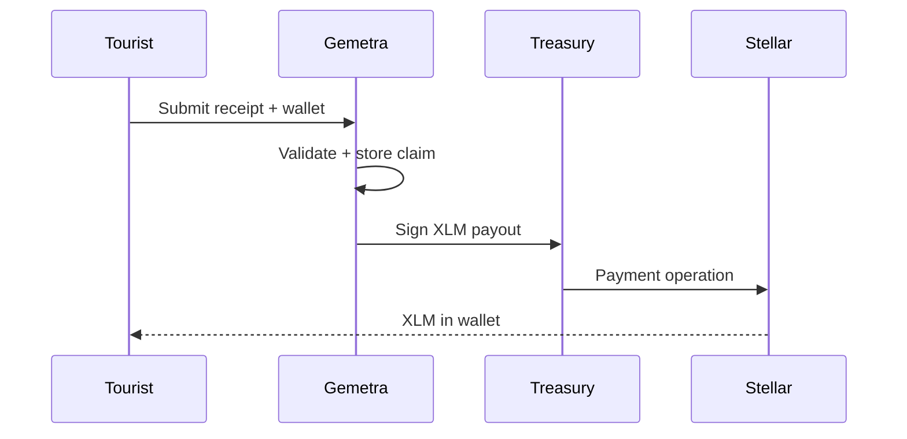

> **Note (2026):** This document is a **hackathon submission narrative**. For accurate technical setup, architecture, and migrations see [README.md](../README.md) and [docs/README.md](../docs/README.md). Payroll and WalletConnect sections below are **historical** — the app is now **VAT-only on Stellar**.

# Devpost Submission — Gemetra-XLM

## Inspiration

Millions of tourists lose **$200B+ annually** in unclaimed VAT refunds due to airport queues, paperwork, and slow processing. Gemetra delivers refunds as **XLM on Stellar** — fast, transparent, wallet-native.

---

## What it does (current)

### Tourist VAT refunds
- Upload receipt (PDF/JPG), select **claim country** (53 supported)
- Passport scan + form validation
- **Treasury pays XLM** directly to tourist wallet
- **Gemetra Points** on every completed claim

### Admin operations dashboard
- Wallet-gated admin (`VITE_ADMIN_PUBLIC_KEY`)
- View / filter / export all XLM claims
- **Pay**, **cancel**, or **blacklist** pending claims
- Real-time refresh + detail modal

### AI assistant
- Gemini-powered help for VAT rules, Stellar, and user claims

---

## How we built it

| Component | Technology |
|-----------|------------|
| Frontend | React, Vite, TypeScript, Tailwind |
| Wallets | Stellar Wallets Kit (Freighter, Albedo) |
| Database | Supabase PostgreSQL |
| Payouts | Supabase Edge Function + native XLM |
| AI | Google Gemini |
| Contract | Soroban `vat-refund` v2 (mainnet live) |

---

## Challenges

- Migrating from legacy multi-chain test data to **XLM-only Stellar**
- Treasury payout reliability (edge function deploy, balance checks, dev fallback)
- Per-country VAT rules across 53 jurisdictions
- Wallet-native auth without Supabase Auth

---

## What's next

- Government reimbursement UI in Supabase/admin
- Automatic XLM on points conversion
- Merchant / airport kiosk mode
- SCF grant for Dubai / global VAT partnerships

---

## Links

- Repo: Gemetra-XLM
- Docs: [docs/README.md](./README.md)
- Stellar Expert for tx verification
