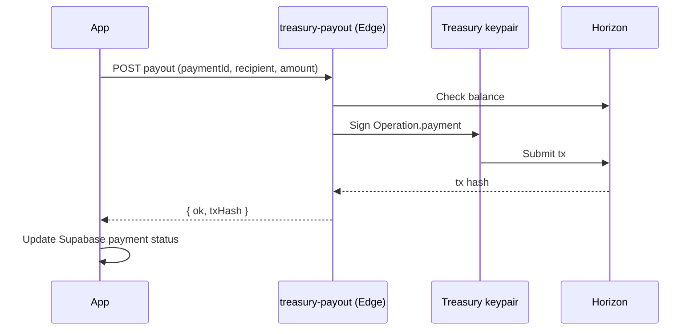

# Environment Setup Guide

Gemetra runs on **Stellar (XLM)** with **Freighter/Albedo** wallets and **Supabase** for persistence. Identity is the wallet public key (`G...`), not Supabase Auth.

---

## Required variables

```env
# Supabase
VITE_SUPABASE_URL=https://your-project.supabase.co
VITE_SUPABASE_ANON_KEY=your_supabase_anon_key

# Stellar
VITE_STELLAR_NETWORK=mainnet
# VITE_HORIZON_URL=https://horizon.stellar.org

# Platform wallets (public — safe in client)
VITE_ADMIN_PUBLIC_KEY=G...
VITE_TREASURY_PUBLIC_KEY=G...
```

| Network | `VITE_STELLAR_NETWORK` | Horizon |
|---------|------------------------|---------|
| Testnet | `testnet` | `https://horizon-testnet.stellar.org` |
| Mainnet | `mainnet` | `https://horizon.stellar.org` |

---

## Treasury payouts (server-side secret)

**Never commit** `TREASURY_SECRET_KEY`.

| Environment | How payouts run |
|---------------|-----------------|
| **Production** | Supabase Edge Function `treasury-payout` + secrets |
| **Local dev** | `vite-plugin-treasury-dev.ts` reads `.env` |

```env
# Local dev only
TREASURY_SECRET_KEY=S...
TREASURY_PUBLIC_KEY=G...
STELLAR_NETWORK=mainnet
```

Deploy edge function:

```bash
pnpm run deploy:treasury
supabase secrets set TREASURY_SECRET_KEY=... TREASURY_PUBLIC_KEY=G... ADMIN_PUBLIC_KEY=G... STELLAR_NETWORK=mainnet --project-ref gtcmjxfqjtnshexujgmq
```



---

## Optional variables

```env
# Gemini AI assistant
VITE_GEMINI_API_KEY=...

# EmailJS notifications
VITE_EMAILJS_PUBLIC_KEY=...
VITE_EMAILJS_SERVICE_ID=...
VITE_EMAILJS_TEMPLATE_ID=...

# Soroban vat-refund (optional; must match VITE_STELLAR_NETWORK)
# Mainnet live: CBLVEZQ2RPBZQ6IPXW5TIL4DDM2IZ5QYDPTKTQ4CSDAINGT6MICKNQED
# Testnet live: CAWEJXNXUZVF2RTKKEWONQ442E3KLB6B55NV33NJLPRBC56WYSZJAOBP
# VITE_ENABLE_VAT_REFUND_ONCHAIN=true
# VITE_VAT_REFUND_CONTRACT_ID=CBLVEZQ2RPBZQ6IPXW5TIL4DDM2IZ5QYDPTKTQ4CSDAINGT6MICKNQED
# VITE_SOROBAN_RPC_URL=https://mainnet.sorobanrpc.com
```

---

## Wallets

- [Freighter](https://www.freighter.app/) (browser extension)
- [Albedo](https://albedo.link/) (web)

Fund testnet via [Stellar Laboratory Friendbot](https://laboratory.stellar.org/#account-creator?network=test).

---

## Checklist

- [ ] Supabase URL + anon key set
- [ ] All 5 migrations applied ([list](./README.md#migration-order-run-in-supabase-sql-editor))
- [ ] Admin/treasury public keys match your wallet
- [ ] Treasury secret configured (edge function or local `.env`)
- [ ] `pnpm dev` runs without env errors

---

## Resources

- [Stellar docs](https://developers.stellar.org/)
- [Stellar Expert](https://stellar.expert/)
- [Supabase docs](https://supabase.com/docs)
