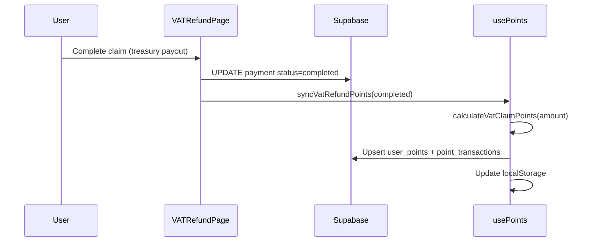
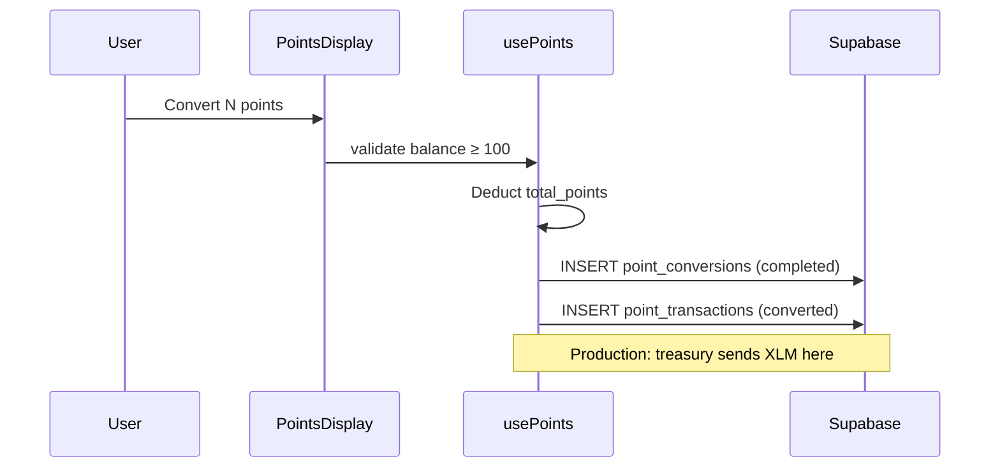

# Points & Rewards System

Gemetra Points reward tourists for completed VAT claims. Points can be converted to bonus XLM (ledger only until treasury payout is wired for conversions).

---

## Earning points

Formula (`src/utils/travelerPoints.ts`):

```
points = 25 (base) + floor(refund_amount_xlm × 10)
```

Example: 2.5 XLM refund → `25 + 25 = 50` points.

Points sync after completed claims via `usePoints.syncVatRefundPoints()`.



---

## Display

- **Nav badge** — current balance (`PointsDisplay`)
- **My Refunds** — lifetime points from claims
- **History** — earned / converted transactions

---

## Conversion (100 points = 1 XLM)

Minimum **100 points**. Conversion deducts points and records a `point_conversions` row. Automatic XLM transfer on conversion is **not** fully automated in production — see [CONVERSION_FLOW.md](./CONVERSION_FLOW.md).



---

## Database tables

### `user_points`
| Column | Description |
|--------|-------------|
| `user_id` | Stellar wallet (`G...`) |
| `total_points` | Spendable balance |
| `lifetime_points` | All-time earned |

### `point_transactions`
| Column | Description |
|--------|-------------|
| `transaction_type` | `earned` · `converted` · `expired` |
| `source` | `vat_refund` · `conversion` · … |
| `source_id` | Payment id or tx hash |

### `point_conversions`
| Column | Description |
|--------|-------------|
| `xlm_amount` | points ÷ 100 |
| `conversion_rate` | 100 |
| `transaction_hash` | Optional on-chain payout ref |

---

## Integration points

| Component | Role |
|-----------|------|
| `VATRefundPage.tsx` | Triggers sync after completed payout |
| `RefundHistoryPage.tsx` | Shows points per claim |
| `PointsDisplay.tsx` | Balance, convert modal, history |
| `usePoints.ts` | Earn, convert, Supabase sync |

---

## Testing

1. Submit and complete a VAT claim
2. Check nav points badge increased
3. Open convert modal — 100+ points required
4. Inspect `point_transactions` in Supabase Table Editor

---

## Future

- Treasury-backed automatic XLM on conversion
- Soroban contract for on-chain points ledger
- Promotional bonus multipliers
