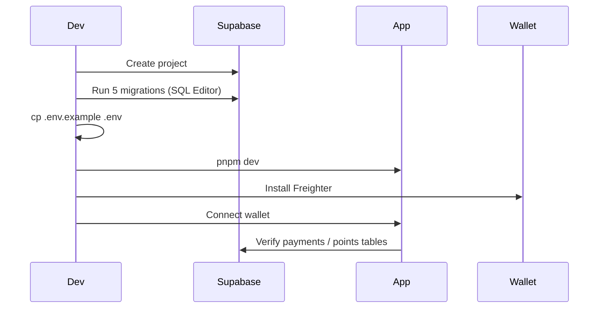

# Quick Setup (5 minutes)

## 1. Supabase project

1. [app.supabase.com](https://app.supabase.com) → **New Project** → name `Gemetra-XLM`
2. **Settings → API** → copy **Project URL** and **anon public key**

## 2. Run migrations

In **SQL Editor**, run each file in `supabase/migrations/` **in order**:

| # | File |
|---|------|
| 1 | `20260131000000_initial_schema.sql` |
| 2 | `20260223000000_stellar_only_cleanup.sql` |
| 3 | `20260223120000_drop_employees_payroll.sql` |
| 4 | `20260223130000_purge_non_xlm_vat_refunds.sql` |
| 5 | `20260223140000_admin_cancel_blacklist.sql` |

Or via CLI:

```bash
supabase login
supabase db push --project-ref gtcmjxfqjtnshexujgmq
```

## 3. Environment file

```bash
cp .env.example .env
```

Required:

```env
VITE_SUPABASE_URL=https://YOUR_REF.supabase.co
VITE_SUPABASE_ANON_KEY=eyJ...
VITE_STELLAR_NETWORK=mainnet
VITE_ADMIN_PUBLIC_KEY=G...
VITE_TREASURY_PUBLIC_KEY=G...

# Optional — live Soroban registry (same network as VITE_STELLAR_NETWORK)
# VITE_ENABLE_VAT_REFUND_ONCHAIN=true
# VITE_VAT_REFUND_CONTRACT_ID=CBLVEZQ2RPBZQ6IPXW5TIL4DDM2IZ5QYDPTKTQ4CSDAINGT6MICKNQED
# VITE_SOROBAN_RPC_URL=https://mainnet.sorobanrpc.com
```

Local treasury payouts (dev only):

```env
TREASURY_SECRET_KEY=S...
TREASURY_PUBLIC_KEY=G...
```

## 4. Run app

```bash
pnpm install
pnpm dev
```

Open `http://localhost:5173` → connect **Freighter** or **Albedo**.

## Setup sequence



## Verify

- [ ] Wallet connects (`G...` address in nav)
- [ ] Submit Refund form loads
- [ ] Admin tab visible when admin wallet connected
- [ ] `claim_blacklist` table exists (Table Editor)
- [ ] No `employees` table (removed)

Full guide: [SUPABASE_SETUP_GUIDE.md](./SUPABASE_SETUP_GUIDE.md)
