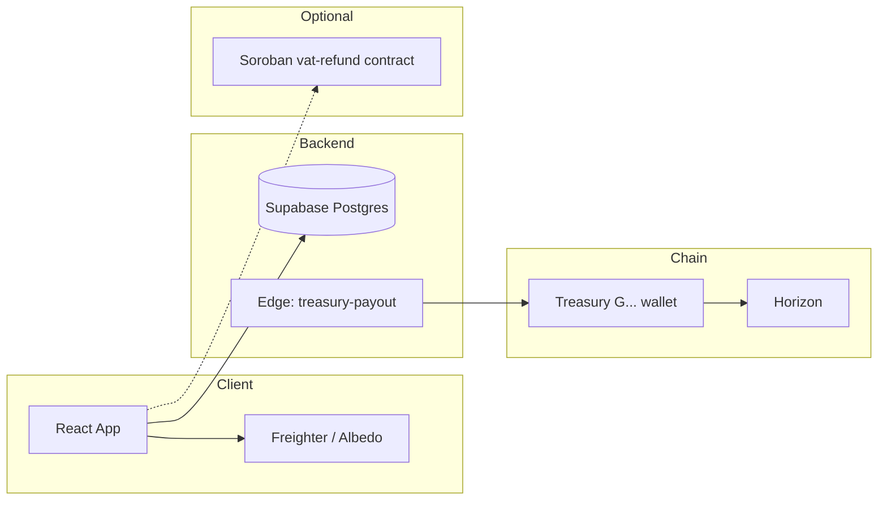

# Gemetra Documentation Index

All project-owned markdown lives here. Upstream Stellar agent skills (`.agents/skills/`) are maintained separately and are not listed below.

| Document | Description |
|----------|-------------|
| [QUICK_SETUP.md](./QUICK_SETUP.md) | 5-minute Supabase + env checklist |
| [SUPABASE_SETUP_GUIDE.md](./SUPABASE_SETUP_GUIDE.md) | Full Supabase project setup |
| [ENVIRONMENT_SETUP.md](./ENVIRONMENT_SETUP.md) | Environment variables & wallets |
| [TROUBLESHOOTING.md](./TROUBLESHOOTING.md) | Common dev/build/Supabase issues |
| [SUPABASE_AUDIT_FIXES.md](./SUPABASE_AUDIT_FIXES.md) | Schema history & verification SQL |
| [POINTS_SYSTEM.md](./POINTS_SYSTEM.md) | Gemetra Points earn/convert flow |
| [CONVERSION_FLOW.md](./CONVERSION_FLOW.md) | Points → XLM conversion sequence |
| [VAT_REFUND_DOCUMENT_FORMAT_GUIDE.md](./VAT_REFUND_DOCUMENT_FORMAT_GUIDE.md) | Receipt upload requirements |
| [VAT_REFUND_SAMPLE_DATA.md](./VAT_REFUND_SAMPLE_DATA.md) | Test form data (Stellar addresses) |
| [FEATURE_IDEAS.md](./FEATURE_IDEAS.md) | Roadmap & hackathon ideas |
| [DEVPOST_SUBMISSION.md](./DEVPOST_SUBMISSION.md) | Hackathon submission narrative |
| [../contracts/README.md](../contracts/README.md) | Soroban `vat-refund` contract |
| [../README.md](../README.md) | Main project README |

## Architecture at a glance

## Migration order (run in Supabase SQL Editor)

1. `20260131000000_initial_schema.sql`
2. `20260223000000_stellar_only_cleanup.sql`
3. `20260223120000_drop_employees_payroll.sql`
4. `20260223130000_purge_non_xlm_vat_refunds.sql`
5. `20260223140000_admin_cancel_blacklist.sql`

Or: `supabase db push --project-ref gtcmjxfqjtnshexujgmq`
