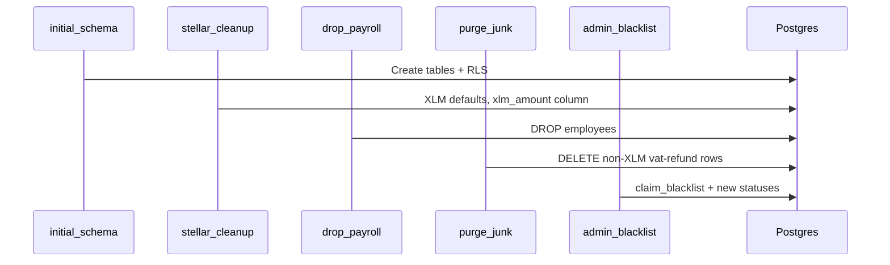

# Supabase Schema Audit & Fixes

Historical notes and **current** migration state for Gemetra-XLM (Stellar wallet auth, VAT-only).

---

## Current migration set

Replace all legacy migration filenames (`20250617...`, etc.) with:

| Order | File |
|-------|------|
| 1 | `20260131000000_initial_schema.sql` |
| 2 | `20260223000000_stellar_only_cleanup.sql` |
| 3 | `20260223120000_drop_employees_payroll.sql` |
| 4 | `20260223130000_purge_non_xlm_vat_refunds.sql` |
| 5 | `20260223140000_admin_cancel_blacklist.sql` |

---

## Fixes applied in codebase (not separate SQL files)

| Issue | Resolution |
|-------|------------|
| Placeholder Supabase URL/key | `src/lib/supabase.ts` validates env at startup |
| Email auth vs wallet auth | App uses `user_id text` = Stellar `G...` address everywhere |
| MNEE / Ethereum tokens | Cleanup migration forces `token = XLM`, `network = stellar` |
| Payroll `employees` table | Dropped in migration 3 |
| Non-XLM VAT junk data | Purged in migration 4 |
| Admin cancel + blacklist | Migration 5 adds statuses + `claim_blacklist` |
| WalletConnect / wagmi | Removed — Stellar Wallets Kit only |

---

## Schema evolution



---

## Verification

```sql
-- Wallet-friendly columns
SELECT column_name, data_type
FROM information_schema.columns
WHERE table_name = 'payments'
  AND column_name IN ('employee_id', 'user_id', 'status');

-- employee_id must be text (stores 'vat-refund')
-- user_id must be text (Stellar G... address)

-- Blacklist RLS
SELECT policyname, cmd FROM pg_policies WHERE tablename = 'claim_blacklist';
```

Expected console on app load:

```
✅ Supabase client initialized with: { url: 'https://...', keyPrefix: 'eyJ...' }
```

---

## Auth model

- **No Supabase Auth** in the main user flow
- Wallet public key is the user identifier
- RLS policies are permissive (`public`); app filters by connected wallet
- Admin access: client checks `VITE_ADMIN_PUBLIC_KEY` / `isAdminAddress()`

---

## LocalStorage vs Supabase

| Data | Primary | Backup |
|------|---------|--------|
| Payments | Supabase | localStorage cache in `usePayments` |
| Points | localStorage | Supabase sync |
| Chat | Supabase | — |

---

## Next steps after audit

1. Confirm all 5 migrations applied (verification SQL above)
2. Set treasury edge function secrets for production payouts
3. Do not re-run purge migration unless re-importing test junk data
