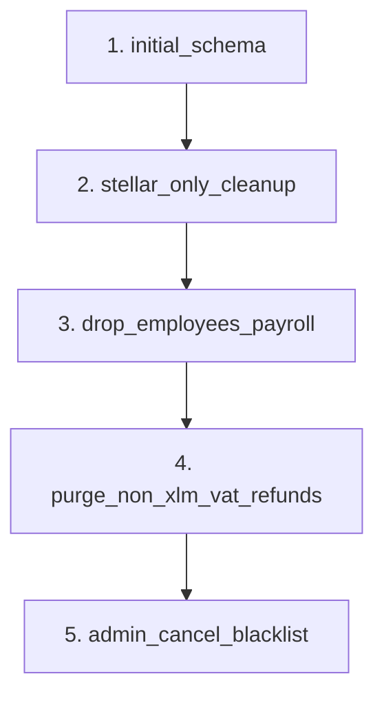
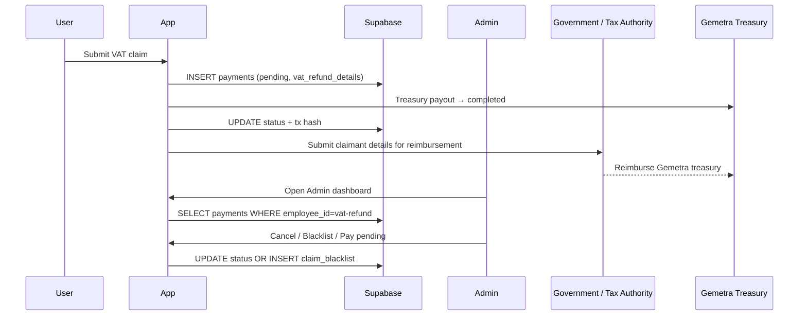

# Supabase Setup Guide

Complete setup for the **Gemetra-XLM** Supabase project (`gtcmjxfqjtnshexujgmq` / Gemetra-Mnea).

---

## Step 1: Create project

1. [app.supabase.com](https://app.supabase.com) → **New Project**
2. Name: `Gemetra-XLM`, region: closest to users (e.g. Asia-Pacific)
3. Save the **database password**

---

## Step 2: API keys

**Settings → API**:

- **Project URL** → `VITE_SUPABASE_URL`
- **anon public** key → `VITE_SUPABASE_ANON_KEY`
- **service_role** (server only, never in frontend)

---

## Step 3: Migrations

### Option A — SQL Editor (manual)

Run each file in order from `supabase/migrations/`:



| Migration | Purpose |
|-----------|---------|
| `20260131000000_initial_schema.sql` | Core tables, indexes, RLS |
| `20260223000000_stellar_only_cleanup.sql` | XLM defaults, rename MNEE columns |
| `20260223120000_drop_employees_payroll.sql` | Drop `employees` (VAT-only app) |
| `20260223130000_purge_non_xlm_vat_refunds.sql` | Delete junk PUSD/SOL/0x rows |
| `20260223140000_admin_cancel_blacklist.sql` | `cancelled`/`blacklisted` status + `claim_blacklist` |

### Option B — CLI

```bash
npm i -g supabase
supabase login
supabase link --project-ref gtcmjxfqjtnshexujgmq
supabase db push
```

---

## Step 4: Expected schema

### Tables (after all migrations)

| Table | Purpose |
|-------|---------|
| `payments` | VAT claims (`employee_id = 'vat-refund'`) |
| `claim_blacklist` | Blocked wallets/passports |
| `user_points` | Points balance per wallet |
| `point_transactions` | Points ledger |
| `point_conversions` | Points → XLM conversions |
| `chat_sessions` / `chat_messages` | AI assistant history |
| `notifications` | In-app notifications |
| `users` | Legacy email table (unused by wallet flow) |

**Removed:** `employees`, `scheduled_payments`

### Payment statuses

`pending` · `completed` · `failed` · `cancelled` · `blacklisted`

---

## Step 5: Configure `.env`

```env
VITE_SUPABASE_URL=https://xxxxx.supabase.co
VITE_SUPABASE_ANON_KEY=eyJ...
VITE_STELLAR_NETWORK=mainnet
VITE_ADMIN_PUBLIC_KEY=G...
VITE_TREASURY_PUBLIC_KEY=G...
```

No WalletConnect or MetaMask required.

---

## Step 6: Verification SQL

```sql
-- Tables
SELECT table_name FROM information_schema.tables
WHERE table_schema = 'public' ORDER BY table_name;

-- claim_blacklist exists, employees gone
SELECT EXISTS (SELECT 1 FROM information_schema.tables WHERE table_name = 'claim_blacklist');
SELECT EXISTS (SELECT 1 FROM information_schema.tables WHERE table_name = 'employees');

-- Status constraint
SELECT pg_get_constraintdef(oid) FROM pg_constraint WHERE conname = 'payments_status_check';

-- XLM VAT claims only
SELECT status, COUNT(*) FROM payments
WHERE employee_id = 'vat-refund' GROUP BY status;
```

---

## Step 7: Test flows



1. Connect wallet → Submit Refund → check **My Refunds**
2. Connect **admin wallet** → **Admin** tab → claims list
3. Test cancel/blacklist on a pending claim (requires migration 5)

### Important model note

The `payments` table currently tracks the **tourist payout leg** of the refund:

- `pending` = claim created, not yet paid by Gemetra treasury
- `completed` = Gemetra treasury paid the tourist

Government reimbursement back to Gemetra treasury is part of the operating model and is **modeled in the optional Soroban `contracts/vat-refund` contract** (states like `GovernmentSubmitted`, `GovernmentApproved`, `TreasuryReimbursed`).

However, it is still **not yet represented as a separate Supabase table/state machine**. The current app UI continues to show the tourist payout leg via `payments.status` (`pending` vs `completed`).

---

## Troubleshooting

| Issue | Fix |
|-------|-----|
| Missing env vars | `.env` in project root, restart `pnpm dev` |
| RLS / permission denied | Re-run migrations; check `payments` policies |
| Admin shows 0 claims | Rows must be `token=XLM`, `user_id` = valid `G...` address |
| Cancel/blacklist fails | Run `20260223140000_admin_cancel_blacklist.sql` |
| Junk PUSD/SOL rows | Run purge migration or wait for client-side filter |

See [TROUBLESHOOTING.md](./TROUBLESHOOTING.md).

---

## Checklist

- [ ] Project created, API keys in `.env`
- [ ] All 5 migrations applied
- [ ] `claim_blacklist` table present
- [ ] `employees` table absent
- [ ] Wallet connect works
- [ ] VAT submit + admin panel work
