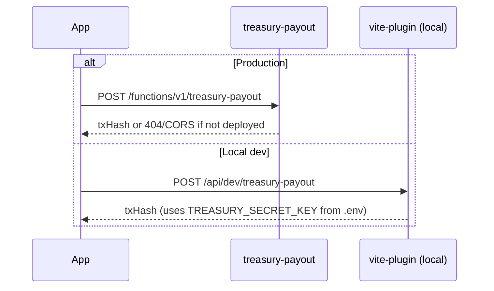

# Troubleshooting Guide

Common issues when developing and deploying Gemetra-XLM.

---

## Supabase & database

### Missing environment variables

```
Missing Supabase environment variables
```

- Create `.env` from `.env.example`
- Keys must start with `VITE_`
- Restart `pnpm dev` after changes

### RLS / permission denied

- Run all 5 migrations in order ([docs/README.md](./README.md))
- VAT rows use `employee_id = 'vat-refund'`

### Admin panel shows 0 claims

Claims must pass client filter:

- `token = 'XLM'`
- `user_id` matches `^G[A-Z2-7]{55}$`

Run purge migration if legacy junk exists:

```sql
SELECT id, token, user_id, status FROM payments WHERE employee_id = 'vat-refund';
```

### Cancel / blacklist fails

Apply `20260223140000_admin_cancel_blacklist.sql` — adds `cancelled`/`blacklisted` statuses and `claim_blacklist` table.

---

## Treasury payouts



| Error | Cause | Fix |
|-------|-------|-----|
| 404 / CORS on payout | Edge function not deployed | `pnpm run deploy:treasury` + secrets |
| Low balance | Treasury account empty | Fund treasury `G...` wallet |
| Service unavailable | Network / Horizon down | Retry; check `STELLAR_NETWORK` |

See [ENVIRONMENT_SETUP.md](./ENVIRONMENT_SETUP.md).

---

## Wallet

- Use **Freighter** or **Albedo** — not MetaMask
- Addresses must be **56-char Stellar `G...`**
- Mainnet = real XLM; use testnet for experiments

---

## Build & dependencies

### ERR_PNPM_OUTDATED_LOCKFILE

```bash
rm -rf node_modules pnpm-lock.yaml
pnpm install
```

Or: `pnpm install --no-frozen-lockfile`

### Clean rebuild

```bash
rm -rf node_modules .vite dist
pnpm install
pnpm build
```

### Node / pnpm versions

- Node 18+
- pnpm 10.x (`corepack enable && corepack use pnpm@10.22.0`)

---

## Soroban contract build

Requires Rust ≥ 1.84:

```bash
curl --proto '=https' --tlsv1.2 -sSf https://sh.rustup.rs | sh
rustup target add wasm32v1-none
pnpm run contract:build
```

---

## Getting help

1. Browser DevTools → Console + Network
2. Supabase Dashboard → Logs
3. Verify migrations with SQL in [SUPABASE_SETUP_GUIDE.md](./SUPABASE_SETUP_GUIDE.md)
