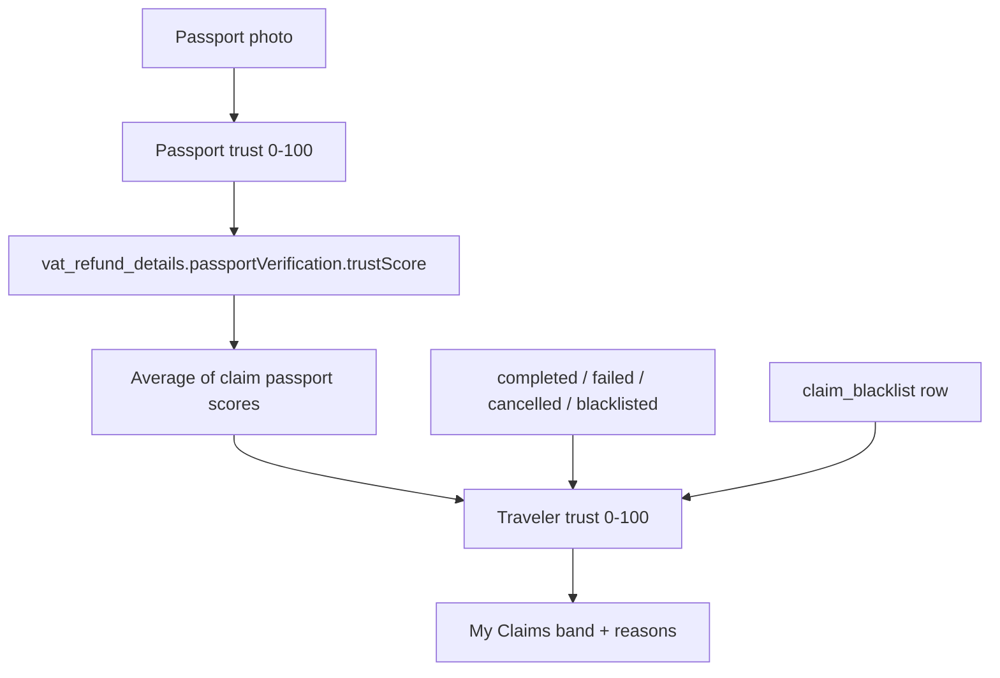
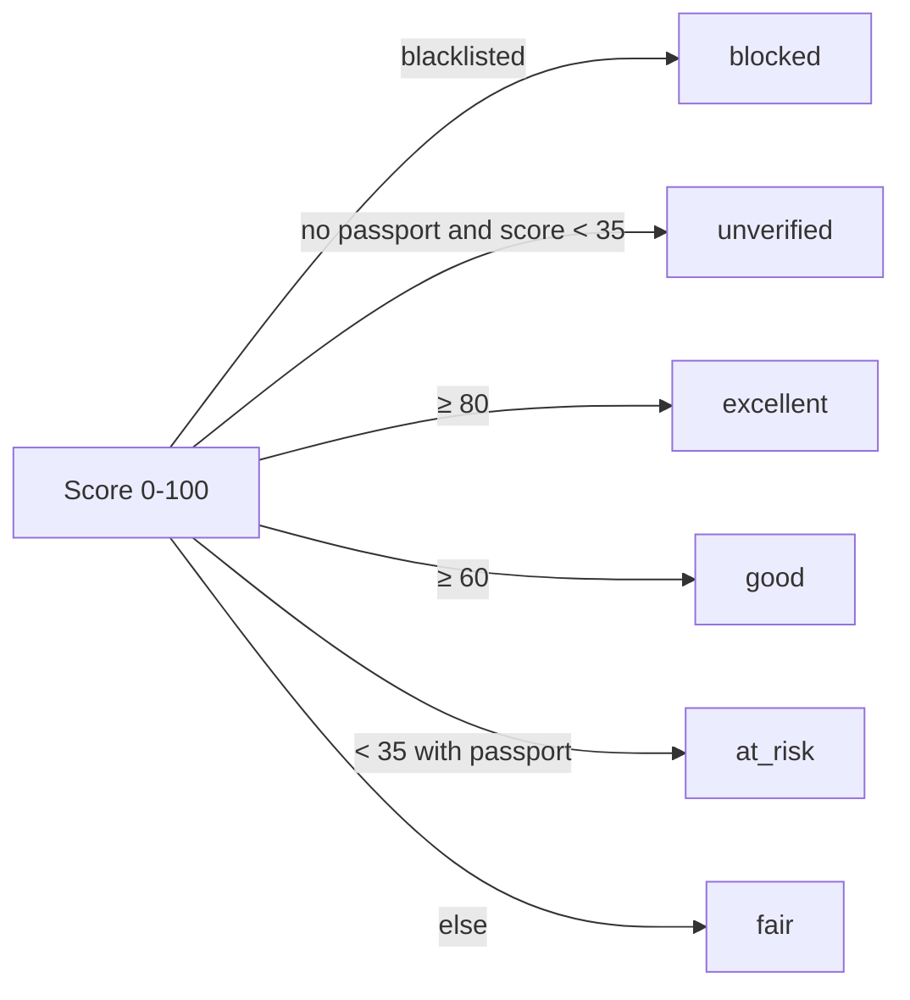

# Passport & traveler trust scores

Gemetra uses two 0–100 scores. They are **not** the same value.

| Score | Scope | Where it shows | Source |
|-------|--------|----------------|--------|
| **Passport trust** | One claim / one scan | Submit Refund, claim detail, admin | Image + MRZ + VIZ checks |
| **Traveler trust** | Wallet history | **My Claims** hub | Passport averages + payout outcomes + blocklist |

Sensitive images stay off-chain. Only verification **metadata** is stored on `payments.vat_refund_details.passportVerification`.

Code: `src/services/passportVerification/index.ts`, `src/utils/travelerTrust.ts`.

---

## How they connect



---

## Passport score (per claim)

Starts at **0**. Capped at **100**. Built during client verification (`verifyPassport`).

| Check | Points |
|-------|--------|
| Image quality **acceptable** | **+25** |
| Else quality score ≥ 45 | **+15** |
| MRZ check digits valid (ICAO Doc 9303) | **+40** |
| Else MRZ present but digits fail | **+18** |
| VIZ (Gemini) vs MRZ cross-check **passed** | **+25** |
| Else both VIZ and MRZ exist but mismatch | **+10** |
| Passport **not expired** and MRZ present | **+10** |

Maximum from these buckets is 25 + 40 + 25 + 10 = **100**.

If a server / third-party fallback runs (Persona, Veriff, or the passport edge function), the stored score is:

```
trustScore = max(client.trustScore, server.trustScore)
```

### Status vs score

`minTrustScore` defaults to **70**. If MRZ check digits are valid and the passport is not expired, the verified threshold is lowered to **55**.

| Condition | `status` |
|-----------|----------|
| Score ≥ threshold **and** MRZ digits valid **and** not expired **and** VIZ/MRZ mismatch | `manual_review` |
| Score ≥ threshold **and** MRZ digits valid **and** not expired | `verified` |
| MRZ present, score ≥ 40 or ≥ 45, not a full verify | `partial` |
| No MRZ | `failed` |

Tiers: `client_mrz` · `client_gemini` · `third_party` · `manual` (skipped scan).

---

## Traveler score (wallet)

`computeTravelerTrust({ claims, blacklist })`.

- **No claims** and not blocklisted → score **0**, band `unverified`.
- Otherwise start at **40**, apply the table, then **clamp 0–100**.

| Input | Effect |
|-------|--------|
| Average of stored passport `trustScore`s | `+ round(avg × 0.35)` (max **+35**) |
| Each `completed` (paid) claim | `+5`, cap **+20** |
| Each claim with passport `status === 'verified'` | `+6`, cap **+12** |
| Each claim with `mrzValid === true` | `+3`, cap **+6** |
| Each `failed` payout | **−12** |
| Each `cancelled` claim | **−6** |
| Any claim with status `blacklisted` | **−25** (once) |
| Passport skipped/manual **and** zero verified scans | **−8** |
| Wallet currently on `claim_blacklist` | `score = min(score − 40, 18)` |

Not used: refund amount, country, receipt fields, Soroban `contractClaimId`.

### Example

One paid claim, passport average **90**, verified, valid MRZ:

```
40 + round(90 × 0.35) + 5 + 6 + 3 = 40 + 32 + 5 + 6 + 3 = 86
```

Band: **Excellent**.

### Bands

`trustBandForScore(score, isBlacklisted, hasPassportData)`:

| Band | When |
|------|------|
| `blocked` | Wallet is on the claim blocklist (label **Blocked**) |
| `excellent` | Score ≥ 80 |
| `good` | Score ≥ 60 (label **Good standing**) |
| `fair` | 35–59, or score ≥ 35 with no passport data |
| `at_risk` | Score < 35 **with** passport data (label **Needs review**) |
| `unverified` | Score < 35 **without** passport data, or no claims (label **Not verified**) |



---

## UI

- **My Claims** — traveler score, band, reason chips, per-claim passport %
- **Submit Refund** — live passport % after scan
- **Admin** — passport % on the claim review panel

Tests: `src/utils/travelerTrust.test.ts`.
