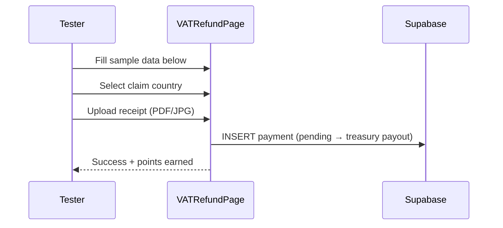

# VAT Refund Form — Sample Data

Use these samples when testing the Submit Refund flow. All wallet addresses are **Stellar `G...` format** (56 characters).

## Claim submission sequence

---

## Sample 1: Luxury Watch (Dubai, AE)

| Field | Value |
|-------|-------|
| VAT Reg No. | GB987654321 |
| Receipt No. | DXB-2024-084729 |
| Bill Amount | 12500.00 AED |
| VAT Amount | 625.00 AED |
| Purchase Date | 15/12/2024 |
| Wallet | `GBRPYHIL2CI3FNQ4BXLFMNDLFJUNPU2HY3ZMFSHONUCEOASW7QC7OX2H` |
| Passport | G12345678 |
| Flight | EK205 |
| Nationality | United Kingdom |
| DOB | 23/05/1987 |
| Merchant | The Dubai Mall - Rolex Boutique |
| Address | Unit 206, The Dubai Mall, Dubai, UAE |

---

## Sample 2: Electronics (London, GB)

| Field | Value |
|-------|-------|
| VAT Reg No. | GB234567890 |
| Receipt No. | LDN-2024-156892 |
| Bill Amount | 3450.00 GBP |
| VAT Amount | 575.00 GBP |
| Purchase Date | 08/11/2024 |
| Wallet | `GDHAGXZUWGJR6AQW25IU74J5JSU5HAKUMUY3SY4JNMJXNXEJCZM7W0AW` |
| Passport | P7654321 |
| Flight | BA286 |
| Nationality | United States |
| Merchant | Harrods Electronics, London |

---

## Sample 3: Fashion (Paris, FR)

| Field | Value |
|-------|-------|
| VAT Reg No. | FR12345678901 |
| Receipt No. | PAR-2024-092341 |
| Bill Amount | 2800.00 EUR |
| VAT Amount | 466.67 EUR |
| Purchase Date | 22/10/2024 |
| Wallet | *(use your connected Freighter `G...` address)* |
| Passport | M9876543 |
| Flight | AF1234 |
| Nationality | Canada |
| Merchant | Galeries Lafayette, Paris |

---

## Sample 4: Jewelry (Dubai, AE)

| Field | Value |
|-------|-------|
| Receipt No. | DXB-2024-112567 |
| Bill Amount | 8750.00 AED |
| VAT Amount | 437.50 AED |
| Wallet | Your connected Freighter address |
| Merchant | Damas Jewellery, Mall of the Emirates |

---

## Notes

- **Token:** XLM only (native Stellar)
- **Dates:** `dd/mm/yyyy` in form; stored ISO in Supabase
- **Country selector:** Drives VAT rate via `vatClaimMath.ts` (53 countries)
- **Minimum purchase:** Varies by country rules in code

## Related

- [VAT_REFUND_DOCUMENT_FORMAT_GUIDE.md](./VAT_REFUND_DOCUMENT_FORMAT_GUIDE.md)
- `samples/vat_receipt_sample.json`
- `samples/receipt_template.txt`
